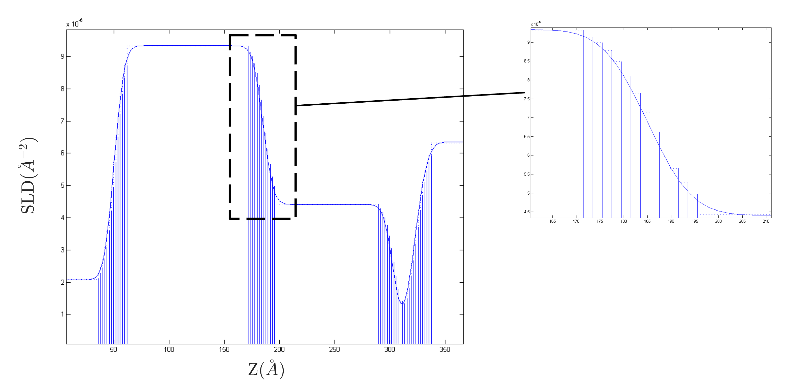
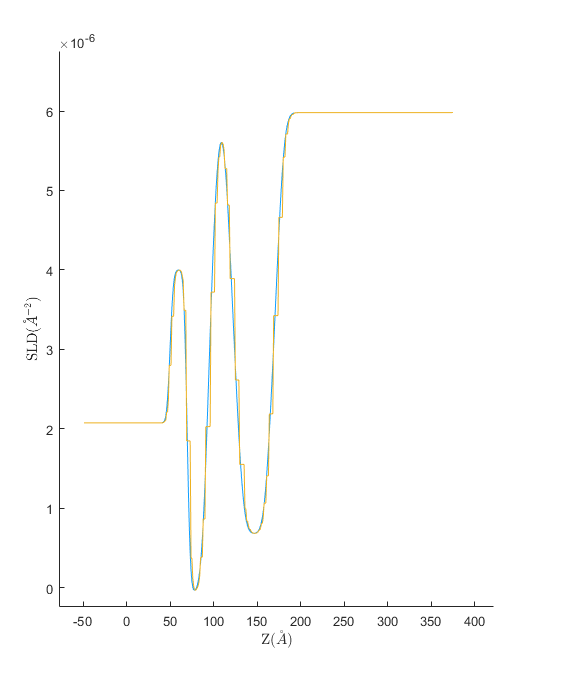
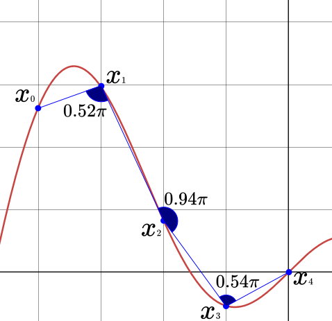

.. _resampling:

===================================
Profile Resampling ('microslicing')
===================================

The Nevot-Croce roughness approximation only strictly holds for cases where the interface roughness is much less than the layer thickness. This usual way
of handling cases where there are such layers, is to split the interfaces into a large number of layers of zero roughness, so that the roughness problem
is circumvented:

However, this kind of 'dumb microslicing' causes the creation of a large number of layers, which may not all be necessary and will significantly slow down the calculation.

This problem of finding the lowest number of individual points that will completely describe a waveform is a common problem in signal processing. RAT uses a technique
borrowed from signal processing called Adaptive Resampling (AR).

AR is an interactive process which aims to find the lowest number of points that will best describe a curve. It does this by adding points where the angle between neighbouring
points becomes smaller than a threshold value. So, it adds more points where the signal is changing most strongly (in order to capture all details of the curvature). So, for a
cosine wave, the resampled points cluster at the regions of the largest curvature:

.. image:: ../images/advanced/adaptiveSpPic.png
     :width: 700
     :alt: adaptive cosine

For the continuous cosine curve show in blue, the AR algorithm has chosen the red points as being most representative. In other words, if the red points were
joined with straight lines, the resulting curve would be very similar to the original signal. The salient point is that more points are required where the gradient
of the signal is changing quickly, and those where the gradient is constant can be represented by fewer points.

RAT borrows the AR trick from the signal processors, and uses this method to resample the SLD profiles. The AR algorithm is used to find the best series of points
that will represent the profile most accurately, and then each of these points is taken as the centre of layer (of zero roughness). The thickness of each layer is half the
distance between neighbouring points. So, for an SLD profile of a floating bilayer (blue line), AR selects the red points:

.. image:: ../images/advanced/dotsSLD.png
     :width: 700
     :alt: sld and dots...

which are then converted into a set of zero roughness layers:

***********************
Using Resampling in RAT
***********************
Using resampling on a contrast in RAT is very simple. For any contrast that you want to resample, simply set the ``resample`` flag for that contrast as shown below:

.. tab-set-code::
     .. code-block:: Matlab

          problem.setContrast(1, 'resample', true);
     
     .. code-block:: Python

          problem.contrasts.set_fields(0, resample=True)

.. tab-set::
    :class: tab-label-hidden
    :sync-group: code

    .. tab-item:: Matlab
        :sync: Matlab

        .. output:: Matlab

          problem = load('source/tutorial/data/twoContrastExample.mat');
          problem = problem.problem;
          problem.setContrast(1, 'resample', true);
          problem.contrasts.displayContrastsObject()

    .. tab-item:: Python 
        :sync: Python
        
        .. output:: Python

            # replace with a better project reading method when we have one...
            with open('source/tutorial/data/two_contrast_example.py', "r") as f:
                script = f.read()
            locals = {}
            exec(script, None, locals)
            problem = locals['problem']
            problem.contrasts.set_fields(0, resample=True)
            print(problem.contrasts)

The resampling operation is controlled by the parameters ``resampleMinAngle`` and ``resampleNPoints`` in the controls object:

.. tab-set::
    :class: tab-label-hidden
    :sync-group: code

    .. tab-item:: Matlab
        :sync: Matlab

        .. output:: Matlab

          controls = controlsClass();
          disp(controls)

    .. tab-item:: Python 
        :sync: Python
        
        .. output:: Python

            controls = RAT.Controls()
            print(controls)

* ``resampleMinAngle``: For each data point, the algorithm draws two lines from that data point to its neighbouring points on either side. 
  If the angle between those lines is smaller than ``resampleMinAngle``, then the algorithm will refine over that point. 

  In practice, this means that resampling happens for points which are significantly higher or lower than their neighbours
  (i.e. the gradient of the function has changed rapidly)
  and ``resampleMinAngle`` controls the sensitivity of this.
  
  ``resampleMinAngle`` is defined in the units of 'radians divided by pi', i.e. ``resampleMinAngle = 0.9`` refines where the adjacent points form an angle smaller than :math:`0.9 \pi` radians.

* ``resampleNPoints``: The initial number of domain points (layers) sampled by the algorithm at the start.

.. note::
        Generally, ``resampleMinAngle`` has a larger effect on the eventual resampling than ``resampleNPoints``.

   A simple example of how resampling calculates angles, with ``resampleNPoints`` = 5. 
   If ``resampleMinAngle`` were set to its default value of 0.9, 
   then resampling would occur around :math:`x_1` and :math:`x_3`, but not :math:`x_2`.

