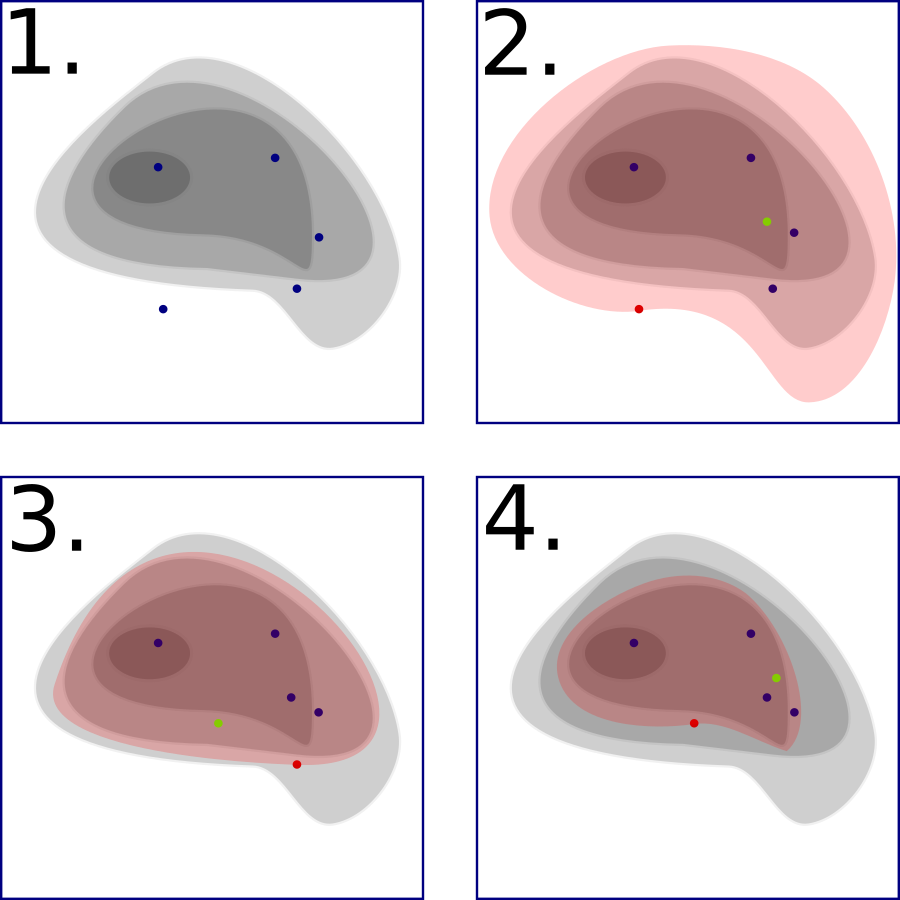

.. _nestedSampling:

==========================================
Bayesian Model Selection - Nested Sampling
==========================================

Nested sampling is a Bayesian model selection algorithm first 
developed by John Skilling in 2004. [#skilling2004]_ It calculates
an estimate for the Bayesian 'evidence' for a model, from which
one can obtain other useful information such as the best fit values
for a set of parameters.

It works by sampling points in the parameter space and calculating how
well the parameter values at each point fit the experimental data given. This fit
is proportional to the "likelihood" that these are the correct values.
It then takes the worst fit point and sets that as the "least likelihood",
and replaces that point with one with a better fit. The process is then repeated.
In practice, this means that the space where we take our samples from becomes a smaller
space containing better and better fitting points, until either a certain number of iterations
have been performed or until a tolerance threshold has been passed.

In the literature, the points which are kept after each iteration are known as 'live points'.

For more background on nested sampling, please see the page for 
`nested sampling algorithms on Wikipedia <https://en.wikipedia.org/wiki/Nested_sampling_algorithm>`_,
or books such as Sivia & Skilling (2006). [#sivia2006]_

   Four iterations of a nested sampling algorithm on a likelihood function
   given by the contour. The red point indicates the least likelihood point
   chosen in each iteration, the green point the new point sampled,
   and the red shaded area is the area from which the green point could be sampled.

Of course, unlike the diagram, we do not know our entire likelihood function in advance (else we wouldn't need this algorithm!). The difficult part
of nested sampling is figuring out how to choose our new points such that they are within the red shaded area. The method of doing this is the main
difference between any two implementations of the nested sampling algorithm. Skilling's original implementation
(found in [#sivia2006]_ or `online here <https://www.inference.org.uk/bayesys/sivia/>`_) did this by choosing a point at a fixed distance and random
angle to one of the live points, calculating its likelihood, and accepting it as the new point if the likelihood is better than the least likelihood;
otherwise, the point is rejected and the process is repeated.

The particular implementation of nested sampling used by RAT is a version of `MatlabMultinest <https://github.com/mattpitkin/matlabmultinest>`_,
modified to be compilable to C++ with MATLAB Coder. MatlabMultinest is a MATLAB implementation of the MultiNest algorithm [#feroz2008]_, which efficiently
selects new points by grouping the live points into 'contours', drawing an ellipsoid around each contour using its covariance matrix, and selecting
a new point randomly from inside one of the ellipsoids.

Algorithm control parameters
----------------------------
The following parameters in the :ref:`Controls object<controlsInfo>` are specific to nested sampling:

- ``nLive``: the number of points to sample. Must be an integer greater than zero.
- ``nMCMC``: if non-zero, MultiNest will not be used, and instead new points will be chosen using an MCMC chain with this many iterations.
  Must be an integer greater than or equal to zero.
- ``propScale``: A scaling factor for the ellipsoid. If this is larger, the algorithm is more likely to choose points near the edges
  of the ellipsoid rather than focusing on the centre. In some cases this may lead to better exploration of the parameter space.
- ``nsTolerance``: The tolerance threshold for when the nested sampler should finish. A smaller value indicates a stricter tolerance. 

  The convergence statistic for each iteration is

  .. math:: \log(\log(Z) + (\log(L_{max}) - j/N_{live})) - \log(Z)

  where :math:`Z` is the evidence, :math:`L_{max}` is the maximum likelihood out of all live points, :math:`j` is the number of iterations,
  and :math:`N_{live}` is the number of live points (``nLive``). The algorithm is considered to have converged when this value
  is less than ``nsTolerance``.

.. [#skilling2004] 
   Skilling, John (2004), 
   "Nested Sampling". 
   DOI: `10.1063/1.1835238 <https://doi.org/10.1063/1.1835238>`_, 
   URL: https://www.inference.org.uk/bayesys/nest.pdf

.. [#sivia2006] 
   Sivia, Devinder; Skilling, John (2006), 
   "Data Analysis: A Bayesian Tutorial". 
   ISBN: 978-0-19-856832-2, 
   URL: https://global.oup.com/academic/product/data-analysis-9780198568322

.. [#feroz2008] 
   Feroz, F.; Hobson, M.P.; Bridges, M. (2008), 
   "MULTINEST: an efficient and robust Bayesian inference tool for cosmology and particle physics". 
   DOI: `10.1111/j.1365-2966.2009.14548.x <https://doi.org/10.1111/j.1365-2966.2009.14548.x>`_,
   URL: https://arxiv.org/abs/0809.3437
