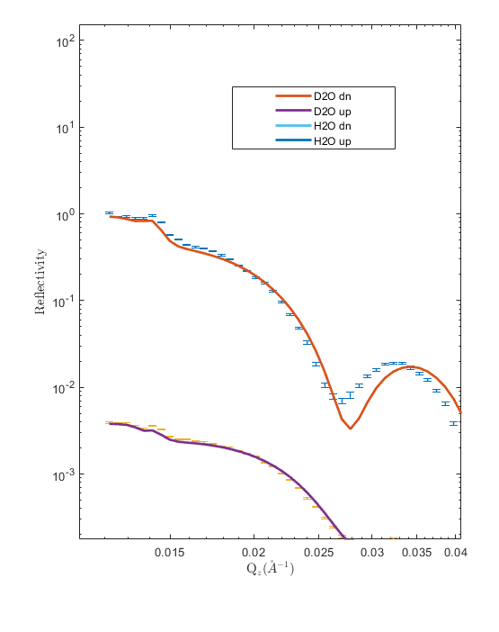

==================================
Absorption (Imaginary SLD) Example
==================================

RAT allows the use of the imaginary, as well as real part of the SLD. The effect of this is usually seen below the critical edge, and must sometimes be accounted for.

For all calculation types, to activate this functionality it is necessary to set the 'absorption' flag when creating the project, as described in :ref:`imaginary`.

This example analyses a bilayer sample on a permalloy/gold substrate, measured using polarised neutrons, against D2O and H2O, leading to
4 contrasts in total. Absorption (i.e. imaginary SLD) is defined for gold and the permalloy, to account for non-flat data below the critical edge. 

This example can be run using the instructions below.

.. tab-set::
    :sync-group: code

    .. tab-item:: Matlab
        :sync: Matlab

        .. note:: The custom model used is a MATLAB model - **examples/miscellaneous/absorption/volumeThiolBilayer.m**.

        **Run Script**: 

        .. code-block:: Matlab 
        
            root = getappdata(0, 'root');
            cd(fullfile(root, 'examples', 'miscellaneous', 'absorption'));
            absorptionDPPC50

    .. tab-item:: Python 
        :sync: Python

        .. note:: The custom model used is a Python model - **RATapi.examples.absorption.volume_thiol_bilayer.py**.

        **Run Script**:  
        
        .. code-block:: console 
            
            python RATapi.examples.absorption.absorption.py

        **Run as Function**:  
        
        .. code-block:: Python 
            
            import RATapi as RAT
            problem, results = RATapi.examples.absorption.absorption()
        
        **Run Interactively**:  
        
        .. code-block:: console 
            
            jupyter notebook RATapi.examples.absorption.absorption.ipynb
