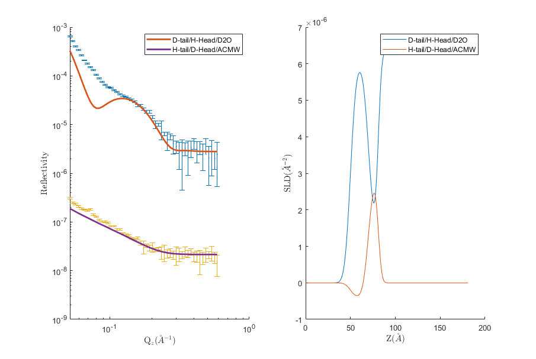

.. _chapter1:

============
Introduction
============

RAT is used to analyse reduced data; after an experiment has been performed and the raw data simplified into a more usable format
(using a data reduction software such as `Mantid <https://docs.mantidproject.org/v4.2.0/techniques/ISIS_Reflectometry.html>`),
we can use RAT for the calculation, estimation, and fitting of quantities of interest. 

The central RAT workflow centres around two objects:

* A **Project** object, which
  describes our data, our models, the various parameters we may have along with their limits or priors,
  and other quantities such as bulk SLD's or backgrounds.

* A **Controls** object, which 
  summarises the actions which we want to do with our model. It specifies which algorithm we
  want to apply to improve our model fit, along with algorithm parameters such as maximum function evaluations, gradients, and parallelism options.

This decoupling is useful as it keeps the experimental model separate from the data analysis being performed upon it. Generally,
one will define a single model and then run it with several different controls objects. For example, we may want to first optimise
our parameter values for our model using a genetic algorithm, and then run a Bayesian analysis to obtain the posterior distributions
for each parameter.

These inputs are passed into RAT to produce
two outputs. The first is a results object which contains the results of the calculations, such as simulated reflectivities, SLD profiles or parameter distributions.
The second is another model definition, which describes the same experiment as the input definition but with updated best-fit parameter values for parameters which
we have chosen to optimise.

We will discuss these further in :ref:`the next chapter<chapter2>`, where we look at the inputs and outputs in more detail.

.. image:: ../images/ratInput.png
    :alt: A flowchart depicting the RAT workflow model described above. On the left, we have two boxes labeled Problem (Input) and Controls,
          representing the required inputs used by RAT.
          An arrow points from each of these boxes to a central box labeled 'RAT', which represents passing these input objects into
          the main RAT program. Two arrows point from this central RAT box to a pair of boxes on the right labelled Problem (Output)
          and Results, indicating the output produced by RAT after the program runs.

The below code block gives the name of each object for each language, as well as how to run a calculation.

.. tab-set-code::
    .. code-block:: Matlab

        % to create a project and controls:
        project = projectClass();
        controls = controlsClass();
        
        % to run:
        [project, results] = RAT(project, controls);

    .. code-block:: Python

        import RATapi as RAT

        # to create a project and controls:
        project = RAT.Project()
        controls = RAT.Controls()

        # to run:
        project, results = RAT.run(project, controls)

.. note::
    If you are a RasCAL-1 user, you probably have existing RasCAL models that you would like to analyse using RAT. If so, there is no need to re-make the model from scratch. Instead, there are
    conversion utilities (:ref:`conversionFuncs`). In fact, for those who prefer a graphical model builder, using the RasCAL-1 GUI to build a basic model and then converting to RAT is a viable workflow.

********************************************
An example - A simple model of a lipid layer
********************************************

Specifying the Model
--------------------

In :ref:`the next chapter<chapter2>`, we'll look in detail how to set up the problem definition for a given situation. 
Here we will just use an existing example model to introduce how these objects are used in RAT.
Our example data is neutron reflectivity data for a lipid monolayer (see image below), collected at various deuterations, 
which we want to analyse simultaneously.

In terms of reflectivity, the interface we want to model (i.e. a monolayer at an air-water interface) is usually well modelled
by two layers: the hydrophobic tail regions of the lipids, which are outside the bulk water interface, and the hydrophilic
heads which are adjacent (or embedded) in the bulk aqueous phase.

In our example, the layers can be either deuterated or hydrogenated, and the bulk water can either be D2O or ACMW.

.. image:: ../images/userManual/chapter1/lipidMonolayer.png
    :width: 300
    :alt: The lipid monolayer example

We are going to analyze our monolayer data using a standard `slab model <https://www.reflectometry.org/learn/3_reflectometry_slab_models/the_slab_model.html>`.
In this model, we approximate our experimental model as a series of layers with a known thickness, roughness, SLD and hydration.
The way that this is represented in the RAT model definition is by a list of 'parameter' objects which represent a given quantity (such as a thickness or SLD),
and then a list of 'layer' objects which group together these parameters to describe each layer. Layers are then grouped together in a 'contrast' object which
describes the slab model and matches it up to the experimental data to which the model will be compared. In this project we have two contrasts representing
two slab models (one for our deuterated experiment, one for our hydrogenated experiment).

The code output below gives the full contents of a model definition for our experiment. After seeing it in full, we will break down each section of this
definition and explain what it describes.

.. tab-set-code::
    .. code-block:: Matlab

        % Load in a pre-made problem Definition class
        root = getappdata(0, 'root');
        problem  = load(fullfile(root, '/examples/tutorialFiles/twoContrastExample.mat'));
        problem = problem.problem;

        % Have a look at what we have
        disp(problem)

    .. code-block:: Python

        # TODO update with data
        problem = get_problem()
        print(problem)

.. tab-set::
    :class: tab-label-hidden
    :sync-group: code

    .. tab-item:: Matlab
        :sync: Matlab

        .. output:: Matlab

            problem = load('source/tutorial/data/twoContrastExample.mat');
            problem = problem.problem;
            disp(problem)

    .. tab-item:: Python 
        :sync: Python

        .. output:: Python
            
            # replace with a better project reading method when we have one...
            with open('source/tutorial/data/two_contrast_example.py', "r") as f:
                script = f.read()
            locals = {}
            exec(script, None, locals)
            problem = locals['problem']
            print(problem)

1. The Parameters Group
^^^^^^^^^^^^^^^^^^^^^^^

.. tab-set::
    :class: tab-label-hidden
    :sync-group: code

    .. tab-item:: Matlab
        :sync: Matlab

        .. output:: Matlab

            problem.parameters.displayTable()

    .. tab-item:: Python 
        :sync: Python

        .. output:: Python

            print(problem.parameters)

This block defines all the parameters that we need to specify our slab models. In our layers case, we
need 10 parameters to define our system: A bulk interface roughness, thickness and roughness for the headgroups and tails, and
SLD values for the layers, depending on whether they are deuterated or not. Each parameter has a given ``value``, a ``fit`` field
which specifies whether they are included in the fitting algorithm, and ``min`` and ``max`` values indicating the minimum and maximum
value they can take in a fit respectively. There are also ``prior_type``, ``mu``, and ``sigma`` fields which are used in Bayesian algorithms
to leverage prior knowledge about the model, but for non-Bayesian algorithms these fields are ignored. We will not use them here.

2. The Layers Group
^^^^^^^^^^^^^^^^^^^

.. tab-set::
    :class: tab-label-hidden
    :sync-group: code

    .. tab-item:: Matlab
        :sync: Matlab

        .. output:: Matlab

            problem.layers.displayTable()

    .. tab-item:: Python 
        :sync: Python

        .. output:: Python

            print(problem.layers)

Once we have our parameters, we then need to group these into layers. We have two slab models, each of which consists of a head
and a tail at different deuteration levels. This means we require 4 layers total. 

3. 'Instrument' Parameters: (Backgrounds, scalefactors and resolutions)
^^^^^^^^^^^^^^^^^^^^^^^^^^^^^^^^^^^^^^^^^^^^^^^^^^^^^^^^^^^^^^^^^^^^^^^

The tables for scalefactors, backgrounds, resolutions and parameters thereof describe 
parameters which are not directly part of our model, but part of our experiment, such as 
the background or resolution of the instrument, or scale factors to fix systemic errors in scaling 
(with respect to absolute reflectivity). We will not discuss these in detail here, but we will note
that background parameters, resolution parameters and scalefactors are parameters just like the ones above,
and can be fit in the same way as part of our analysis (e.g. if the scalefactor is unknown and we would like to optimise it)!

4. Data
^^^^^^^

.. tab-set::
    :class: tab-label-hidden
    :sync-group: code

    .. tab-item:: Matlab
        :sync: Matlab

        .. output:: Matlab

            problem.data.displayTable()

    .. tab-item:: Python 
        :sync: Python

        .. output:: Python

            print(problem.data)

Each contrast must have a dataset associated with it, whether or not it contains data or not. An empty data object 
(i.e. containing no data and just simulation ranges) means RAT will calculate the reflectivity only. When data is present, chi-squared goodness of fit
will also be calculated. For our problem, we have two datasets and these are passed to the data block ready to be incorporated into contrasts:

5. Contrasts
^^^^^^^^^^^^

Once we have defined all the components of our model, we need to group them together into contrasts. We have two datasets 
we want to consider, so two contrasts. We have the relevant instrument parameters, and also we specify which layers are included in each contrast (*model*). 

.. tab-set::
    :class: tab-label-hidden
    :sync-group: code

    .. tab-item:: Matlab
        :sync: Matlab

        .. output:: Matlab

            problem.contrasts.displayContrastsObject()

    .. tab-item:: Python 
        :sync: Python

        .. output:: Python
            
            print(problem.contrasts)

Running the Model
-----------------

As we discussed at the beginning of the chapter, the other input to RAT is a controls object,
which describes the data analysis operation to use and any relevant settings such as 
algorithm-specific parameters, parallelism, and display settings.
More detail on the controls object is available at :ref:`controlsInfo`, 
but for this demo we will just make an instance of the controls object:

.. tab-set-code::
    .. code-block:: Matlab

        % Make an instance of controls class
        controls = controlsClass();
        disp(controls)

    .. code-block:: Python

        # Make an instance of controls class
        controls = RAT.Controls()
        print(controls)

.. tab-set::
    :class: tab-label-hidden
    :sync-group: code

    .. tab-item:: Matlab
        :sync: Matlab

        .. output:: Matlab

            controls = controlsClass();
            disp(controls)

    .. tab-item:: Python 
        :sync: Python
        
        .. output:: Python

            controls = RAT.Controls()
            print(controls)

By default, the Controls object specifies to run an `Abelès calculation <https://www.reflectometry.org/learn/3_reflectometry_slab_models/how_we_calculate_the_reflectivity_of_a_slab_model.html>`
of the reflectivity for the model, and then uses that to calculate SLD profiles. In other words we are not asking RAT to do any kind of fit with our parameters. 
We can now pass our problem definition and controls classes to the RAT toolbox to run the calculation:

.. tab-set-code::
    .. code-block:: Matlab

        [problem, results] = RAT(problem, controls);
        disp(results)

    .. code-block:: Python

        problem, results = RAT.run(problem, controls);
        print(results)

.. tab-set::
    :class: tab-label-hidden
    :sync-group: code

    .. tab-item:: Matlab
        :sync: Matlab

        .. output:: Matlab

            [problem, results] = RAT(problem, controls);

    .. tab-item:: Python 
        :sync: Python

        .. output:: Python

            problem, results = RAT.run(problem, controls)

Here, we overwrite our original input class with the output by using the same variable name (``problem``) as an input and an output, 
but you don’t have to do it this way.

As discussed above, the output of this run is an updated model definition (which in this case is completely identical to the input
definition as we did not perform any fitting) as well as the results from our calculation. The results contain various output arrays:

.. tab-set::
    :class: tab-label-hidden
    :sync-group: code

    .. tab-item:: Matlab
        :sync: Matlab

        .. output:: Matlab

            disp(results)

    .. tab-item:: Python 
        :sync: Python

        .. output:: Python

            print(results)

This contains the results of our calculations, so for us including the SLD profiles and reflectivities calculated from our problem class. 
We can now plot the output, either manually (by taking the relevant parts from the ``results`` array), or using one of the supplied plotting utilities:

.. tab-set-code::
    .. code-block:: Matlab

        fig(1); clf;
        plotRefSLD(problem, results)

    .. code-block:: Python

        RAT.plotting.plot_ref_sld(problem, results)

We can see that our model is looking fairly sensible, but that our guess values for the parameters are pretty wide off the mark. Further analysis
might include running a fit over some of our parameters using one of the other procedures available in the controls object.
