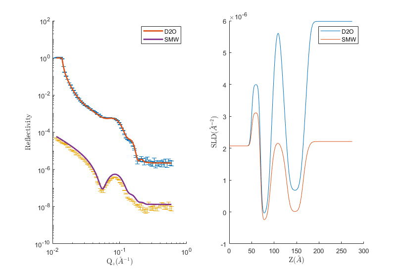
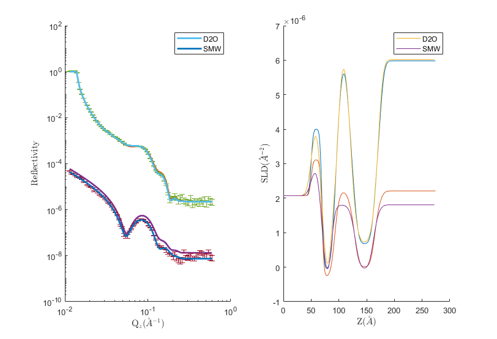
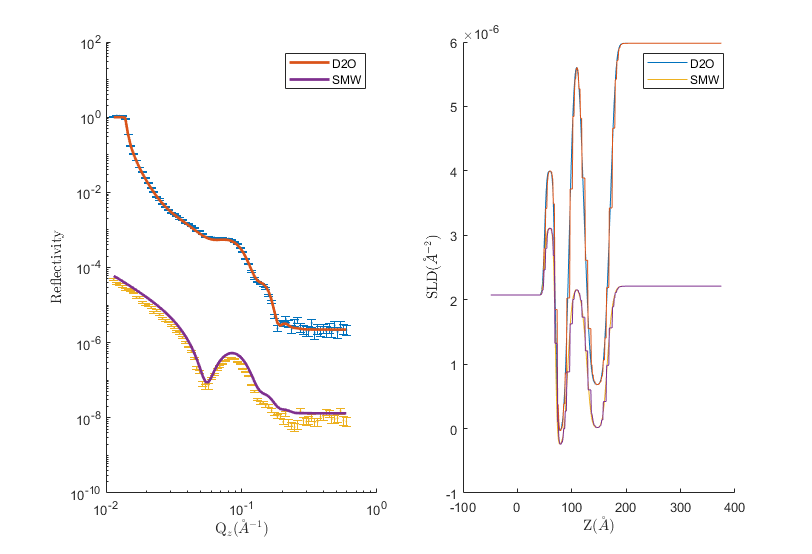

.. _simplePlotting:

==============
Basic Plotting
==============

The simplest plot available is a simple display of the contents of the *problem* and *results* blocks.
The initial problem and result used in this section were made by running :ref:`DSPC Standard Layers<DSPC_Standard_Layers>`, after 
running the example a basic plot takes the following form:

.. tab-set-code::
    .. code-block:: Matlab

        figure(1); clf;
        plotRefSLD(problem, results)
    
    .. code-block:: Python

        RAT.plotting.plot_ref_sld(problem, results)

This produces a basic plot of the reflectivity and SLD.

If this plot is not cleared before subsequent plots, then *plotRefSLD* will overplot allowing the results of calculations to be compared:

.. tab-set-code::
    .. code-block:: Matlab

        controls = controlsClass();
        controls.procedure = 'DE';
        controls.display = 'final';
        controls.parallel = 'contrasts';
        [problem, results] = RAT(problem, controls);
        plotRefSLD(problem, controls);

    .. code-block:: Python
        
        controls = RAT.Controls(procedure='DE', display='final', parallel='contrasts')
        problem, results = RAT.run(problem, controls)
        RAT.plotting.plot_ref_sld(problem, controls)

If you don't wish to overplot, just clear the figure before re-running plotRefSLD.

If you are resampling your SLD's, the *plotRefSLD* will automatically show the resampled layers for you:

