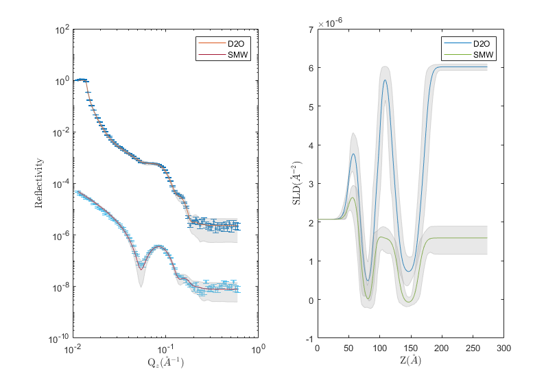
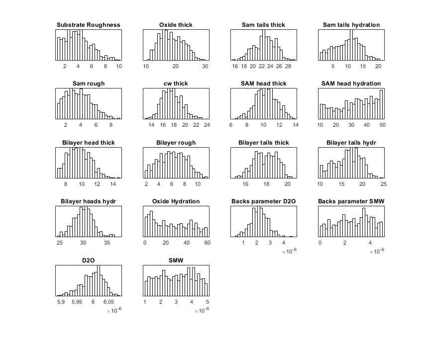
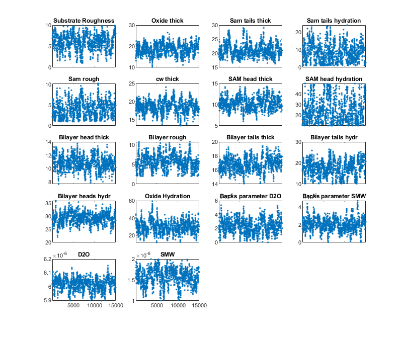

.. _bayesPlotting:

==========================
Plotting Bayesian Analysis
==========================

A number of functions exist for plotting the results of Bayesian analysis. The problem and result used in this section were made using the  
:ref:`DSPC Standard Layers<DSPC_Standard_Layers>` example and a control object with the procedure set to ``DREAM``.

.. tab-set-code::
    .. code-block:: Matlab

        % Run the DSPC standard layers example
        controls = controlsClass();
        controls.procedure = 'dream';
        [problem, results] = RAT(problem, controls);
    
    .. code-block:: Python

        # Run the DSPC standard layer example
        controls = RAT.Controls()
        controls.procedure = 'dream'
        problem, results = RAT.run(problem, controls)

********************
Reflectivity and SLD
********************

A simple reflectivity shaded plot can be displayed as follows:

.. tab-set-code::
    .. code-block:: Matlab

        bayesShadedPlot(problem, results)
    
    .. code-block:: Python

        RAT.plotting.plot_ref_sld(problem, results, bayes=65)

By default, this shows a standard reflectivity plot with a 65% shaded confidence interval.

There are a number of options to customise the plot:

**Interval** - You can specify either the 65% or 95% confidence interval to display:

.. tab-set-code::
    .. code-block:: Matlab

        bayesShadedPlot(problem, results, 'interval', 95)
    
    .. code-block:: Python

        RAT.plotting.plot_ref_sld(problem, results, bayes=95)

.. image:: ../images/misc/bayes95.png
    :width: 800
    :alt: 95 shaded plot

**q4** - You can also specify a q4 plot for the reflectivity:

.. tab-set-code::
    .. code-block:: Matlab

        bayesShadedPlot(problem, results, 'q4', true)
    
    .. code-block:: Python

        RAT.plotting.plot_ref_sld(problem, results, bayes=65, q4=True)

.. image:: ../images/misc/bayesq4.png
    :width: 800
    :alt: bayes q4 plot

Posterior Histograms
....................

You can easily view the marginalised Bayesian posteriors from your analysis:

.. tab-set-code::
    .. code-block:: Matlab

        plotHists(results)
    
    .. code-block:: Python
        
        RAT.plotting.plot_hists(results)

.. image:: ../images/misc/histSmooth.png
    :width: 800
    :alt: smooth hists

By default, the histogram plot function carries out a KDE smooth of the histograms. You can optionally choose no smoothing:

.. tab-set-code::
    .. code-block:: Matlab

        plotHists(results,'smooth',false)
    
    .. code-block:: Python

        RAT.plotting.plot_hists(results, smooth=False)

Corner Plots
............

To produce a corner plot, simply use the corner plot function:

.. tab-set-code::
    .. code-block:: Matlab

        cornerPlot(results)
    
    .. code-block:: Python

        RAT.plotting.plot_corner(results)

    

.. image:: ../images/misc/cornerPlot.png
    :width: 800
    :alt: cornerPlot

Chain View
..........

Finally, you can check the integrity of your markov chain as follows:

.. tab-set-code::
    .. code-block:: Matlab

        plotChain(results);

    .. code-block:: Python

        RAT.plotting.plot_chain(results)

